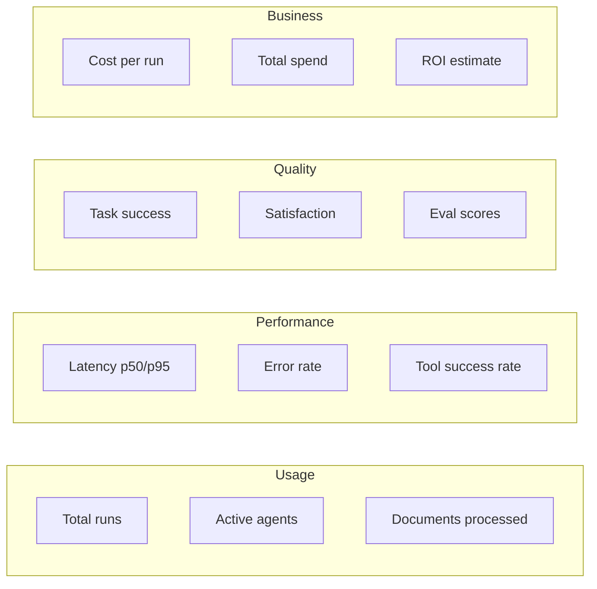

# Agent Statistics & Analytics

## Overview

Analytics dashboards are retention tools. When a user can see that their agent handled 2,400 conversations with a 94% success rate and saved an estimated $18,000 in costs, they will never cancel.

The goal is to surface metrics that answer: **"Is this working?"**

- For a team lead → fewer failed tasks, faster execution
- For a CFO → cost savings vs manual handling
- For a developer → debugging failed runs, optimization

---

## User Stories

### Story 1: Debugging Failed Runs

> "Why did my agent return wrong results for Client A's project last week?"

**Flow:**
1. User opens Agent Stats → Client A
2. Sees error spike on Tuesday
3. Clicks into trace
4. Sees `search_docs` tool timed out → agent retried 3x → wrong context used
5. Fix: optimize tool timeout or add fallback

### Story 2: Cost Optimization

> "Which agents are eating my budget?"

**Flow:**
1. User opens Org Stats
2. Sees "Research Agent" costs $10.8K this month
3. "Summarizer Agent" costs only $645 for same volume
4. Decision: route simpler tasks to Summarizer, keep Research for complex

### Story 3: ROI Justification

> "How do I justify this tool to my boss?"

**Flow:**
1. User opens Project Stats → Client A
2. Dashboard shows:
   - 2,400 agent runs
   - 94% success rate
   - $18,000 saved vs manual handling
3. Export report → present to management

---

## Metric Taxonomy

Organize metrics into four categories:



### Usage Metrics

| Metric | Description | Unit | Aggregation |
|--------|-------------|------|-------------|
| `total_runs` | Total agent executions | count | sum |
| `active_agents` | Agents with ≥1 run | count | count |
| `active_days` | Days with activity | count | count |
| `docs_processed` | Documents processed by agents | count | sum |

### Performance Metrics

| Metric | Description | Unit | Aggregation |
|--------|-------------|------|-------------|
| `latency_p50` | Median response time | ms | p50 |
| `latency_p95` | 95th percentile latency | ms | p95 |
| `error_rate` | Runs with errors | % | rate |
| `tool_failure_rate` | Tool calls that failed | % | rate |
| `tool_latency_p95` | Per-tool latency | ms | p95 |

### Quality Metrics

| Metric | Description | Unit | Aggregation |
|--------|-------------|------|-------------|
| `task_success` | Runs completed successfully | % | rate |
| `satisfaction` | User feedback score | score | avg |
| `eval_score` | Automated quality score | 0-1 | avg |
| `frustration_index` | Implicit dissatisfaction | 0-100 | avg |

### Business Metrics

| Metric | Description | Unit | Aggregation |
|--------|-------------|------|-------------|
| `cost_total` | Total LLM + infra cost | $ | sum |
| `cost_per_run` | Average cost per execution | $ | avg |
| `tokens_input` | Input tokens used | tokens | sum |
| `tokens_output` | Output tokens used | tokens | sum |
| `tokens_cached` | Tokens served from cache | tokens | sum |
| `est_savings` | Estimated vs manual cost | $ | sum |

---

## Dashboard Hierarchy

### Organization Dashboard

**Purpose:** High-level view of all projects and spending

```
┌─────────────────────────────────────────────────────────────┐
│ Organization Stats                              [Period ▼]  │
├─────────────────────────────────────────────────────────────┤
│                                                             │
│ ┌─────────────┐ ┌─────────────┐ ┌─────────────┐ ┌─────────┐ │
│ │ Total Spend │ │ Active Proj │ │ Runs Today │ │ Success │ │
│ │   $24.5K    │ │     12      │ │   1,847     │ │  94.2%  │ │
│ └─────────────┘ └─────────────┘ └─────────────┘ └─────────┘ │
│                                                             │
│ ┌─────────────────────────────────────────────────────────┐ │
│ │ Spend Over Time                          [Line Chart]  │ │
│ │ ▁▂▃▅▆▇▆▅▄▃▂▃▄▅▆▇▆▅▄▃▂▃▄                              │ │
│ └─────────────────────────────────────────────────────────┘ │
│                                                             │
│ Projects Overview                                           │
│ ┌────────────────────────────────────────────────────────┐ │
│ │ Project        │ Runs  │ Cost    │ Success │ Last Run   │ │
│ ├───────────────┼───────┼─────────┼────────┼────────────┤ │
│ │ Client A      │ 2,400 │ $10.8K  │  94%   │ 2h ago     │ │
│ │ Client B      │ 1,200 │ $5.2K   │  91%   │ 1d ago     │ │
│ │ Internal      │   847 │ $3.1K   │  97%   │ 4h ago     │ │
│ └────────────────────────────────────────────────────────┘ │
└─────────────────────────────────────────────────────────────┘
```

### Project Dashboard

**Purpose:** Deep dive into a specific project

```
┌─────────────────────────────────────────────────────────────┐
│ Client A                                       [Period ▼]  │
├─────────────────────────────────────────────────────────────┤
│                                                             │
│ ┌─────────────┐ ┌─────────────┐ ┌─────────────┐ ┌─────────┐ │
│ │ Project Cost│ │ Docs Proc  │ │ Runs       │ │ Success │ │
│ │   $10.8K    │ │    847     │ │   2,400    │ │  94%   │ │
│ └─────────────┘ └─────────────┘ └─────────────┘ └─────────┘ │
│                                                             │
│ Agent Performance                                           │
│ ┌────────────────────────────────────────────────────────┐ │
│ │ Agent              │ Runs │ Cost    │ Latency │ Success │ │
│ ├────────────────────┼──────┼─────────┼─────────┼─────────┤ │
│ │ Code Review Bot    │  847 │ $4.2K   │  1.2s   │  96%   │ │
│ │ PR Assistant       │  523 │ $2.1K   │  0.8s   │  98%   │ │
│ │ Bug Triage Agent   │  634 │ $2.8K   │  2.1s   │  89%   │ │
│ │ Docs Generator     │  396 │ $1.7K   │  3.4s   │  92%   │ │
│ └────────────────────────────────────────────────────────┘ │
│                                                             │
│ Cost Breakdown                           Token Usage        │
│ ┌───────────────────────┐ ┌───────────────────────────────┐ │
│ │ Code Review    ████   │ │ Input ████████████████  45%   │ │
│ │ Bug Triage     ███    │ │ Output █████████████    40%    │ │
│ │ PR Assistant   ██     │ │ Cached ██████          15%    │ │
│ │ Docs Gen       ██     │ └───────────────────────────────┘ │
│ └───────────────────────┘                                 │
└─────────────────────────────────────────────────────────────┘
```

### Agent Dashboard

**Purpose:** Debug and optimize specific agent

```
┌─────────────────────────────────────────────────────────────┐
│ Code Review Bot                               [Period ▼]   │
├─────────────────────────────────────────────────────────────┤
│                                                             │
│ ┌─────────────┐ ┌─────────────┐ ┌─────────────┐ ┌─────────┐ │
│ │ Total Runs  │ │ Avg Cost    │ │ Latency     │ │ Success │ │
│ │    847      │ │   $4.96     │ │   1.2s      │ │  96%   │ │
│ └─────────────┘ └─────────────┘ └─────────────┘ └─────────┘ │
│                                                             │
│ Execution History (Last 50 runs)                           │
│ ┌────────────────────────────────────────────────────────┐ │
│ │ Run ID    │ Status    │ Duration │ Cost   │ Time        │ │
│ ├───────────┼───────────┼─────────┼────────┼─────────────┤ │
│ │ run_847   │ ✓ Success │  1.1s   │ $4.20  │ 2 min ago   │ │
│ │ run_846   │ ✓ Success │  1.3s   │ $5.10  │ 5 min ago   │ │
│ │ run_845   │ ⚠ Slow   │  4.2s   │ $8.40  │ 12 min ago  │ │
│ │ run_844   │ ✗ Error   │  0.8s   │ $3.20  │ 18 min ago  │ │
│ └────────────────────────────────────────────────────────┘ │
│                                                             │
│ Tool Usage                              Eval Scores        │
│ ┌───────────────────────┐ ┌───────────────────────────────┐ │
│ │ search_code     847   │ │ Tool Success     ████████████  │ │
│ │ analyze_pr     634   │ │ Step Efficiency  ██████████    │ │
│ │ write_comment  523   │ │ Latency Score    ████████        │ │
│ │ │ Cached    ██████████      │ │ Cost Efficiency  ██████████    │ │
│ └───────────────────────┘ └───────────────────────────────┘ │
│                                                             │
│ [View Trace] [View Evals] [Export]                         │
└─────────────────────────────────────────────────────────────┘
```

---

## Data Model

### Agent Run Entity

```typescript
interface AgentRun {
  id: string
  agentId: string
  projectId: string
  organizationId: string

  // Timing
  startedAt: Date
  completedAt: Date | null
  durationMs: number

  // Outcome
  status: 'running' | 'success' | 'error' | 'timeout'

  // Cost
  tokensInput: number
  tokensOutput: number
  tokensCached: number
  tokensReasoning: number
  costUsd: number

  // Quality
  evalScore: number | null
  satisfaction: number | null
  frustrationIndex: number | null

  // Metadata
  model: string
  steps: number
  toolsCalled: number
  toolsFailed: number
  errorMessage: string | null

  createdAt: Date
}
```

### Tool Call Entity

```typescript
interface ToolCall {
  id: string
  runId: string
  agentId: string

  toolName: string
  status: 'success' | 'error' | 'timeout'

  inputTokens: number
  outputTokens: number
  durationMs: number
  errorMessage: string | null

  createdAt: Date
}
```

### Aggregated Stats Entity

```typescript
interface AgentStatsHourly {
  id: string
  agentId: string
  hour: Date

  runs: number
  errors: number
  avgLatencyMs: number
  p95LatencyMs: number

  tokensInput: number
  tokensOutput: number
  tokensCached: number

  costUsd: number
  evalScoreAvg: number

  createdAt: Date
}

interface AgentStatsDaily {
  id: string
  agentId: string
  date: Date

  runs: number
  errors: number
  successRate: number
  avgLatencyMs: number
  p95LatencyMs: number

  tokensInput: number
  tokensOutput: number
  tokensCached: number

  costUsd: number
  evalScoreAvg: number
  satisfactionAvg: number

  docsProcessed: number

  createdAt: Date
}
```

---

## Features

### 1. Real-time Monitoring

**What's shown:**
- Active runs (live)
- Recent completions
- Error alerts

**Refresh:** Every 5 seconds for active, 1 minute for historical

### 2. Trace Viewer

**What's shown per run:**
- All steps in order
- Model calls (prompt, response, tokens, cost)
- Tool calls (input, output, duration, error)
- Decision points
- Final output

**Interactions:**
- Click any span to expand
- Compare two runs side-by-side
- Filter by error type

### 3. Evaluation System

**Automated Evals (run after each execution):**

| Criteria | What it measures | Score |
|----------|-----------------|-------|
| `tool_success_rate` | % tool calls without errors | 0-1 |
| `step_efficiency` | Penalizes excessive iterations | 0-1 |
| `latency_score` | Normalized against baseline | 0-1 |
| `cost_efficiency` | Normalized against baseline | 0-1 |
| `error_recovery` | Did agent recover from errors? | 0 or 1 |

**User Feedback:**
- Thumbs up/down on responses
- Optional category on thumbs down (Inaccurate, Not helpful, Wrong tool, Too slow)

### 4. Frustration Index

Computed from implicit signals:

| Signal | Weight | Detects |
|--------|--------|---------|
| Rephrasing | 30% | User repeats similar messages |
| Retry patterns | 20% | "Try again", "no that's wrong" |
| Abandonment | 20% | Session ends shortly after response |
| Sentiment | 15% | Negative language patterns |
| Length trend | 15% | Declining message lengths |

**Score interpretation:**
- 0-20: Healthy
- 20-40: Friction
- 40-60: Dissatisfied
- 60+: Broken session

### 5. Cost Attribution

**Breakdown by:**
- Agent
- Project
- Organization
- User/tier
- Model

**Metrics:**
- Cost per run
- Cost per success
- Cost per user
- Token efficiency

### 6. Export & Reporting

**Formats:**
- PDF report (executive summary)
- CSV (raw data)
- JSON (API format)

**Content:**
- Period selection
- Metric selection
- Comparison to previous period
- Trend charts

---

## API Design

### Endpoints

```bash
# Organization stats
GET /api/v1/organizations/:orgId/stats
GET /api/v1/organizations/:orgId/stats/timeseries?metric=cost&bucket=day

# Project stats
GET /api/v1/projects/:projectId/stats
GET /api/v1/projects/:projectId/stats/agents

# Agent stats
GET /api/v1/agents/:agentId/stats
GET /api/v1/agents/:agentId/stats/timeseries?metric=runs&bucket=hour
GET /api/v1/agents/:agentId/stats/summary?period=30d

# Runs
GET /api/v1/agents/:agentId/runs
GET /api/v1/agents/:agentId/runs/:runId
GET /api/v1/agents/:agentId/runs/:runId/trace

# Tool calls
GET /api/v1/agents/:agentId/tool-calls

# Evals
GET /api/v1/agents/:agentId/evals
POST /api/v1/agents/:agentId/runs/:runId/feedback

# Export
GET /api/v1/agents/:agentId/stats/export?format=csv&period=30d
```

### Request/Response Shapes

```typescript
// Stats summary response
interface AgentStatsResponse {
  agentId: string
  period: { start: Date; end: Date }

  summary: {
    runs: number
    errors: number
    successRate: number
    avgLatencyMs: number
    p95LatencyMs: number
    costUsd: number
    costPerRunUsd: number
    tokensInput: number
    tokensOutput: number
    tokensCached: number
    evalScoreAvg: number
  }

  timeseries: {
    [metric: string]: { timestamp: Date; value: number }[]
  }
}

// Run list response
interface AgentRunsResponse {
  data: AgentRun[]
  pagination: {
    page: number
    perPage: number
    total: number
  }
}

// Trace response
interface AgentRunTraceResponse {
  runId: string
  spans: {
    id: string
    type: 'agent' | 'llm' | 'tool'
    name: string
    startedAt: Date
    durationMs: number
    status: string
    attributes: Record<string, any>
  }[]
  totalTokens: number
  totalCostUsd: number
}
```

---

## Retention Policy

| Data Type | Retention | Reason |
|-----------|-----------|--------|
| Raw runs (last 24h) | Real-time | Debugging |
| Aggregated hourly (7 days) | 7 days | Performance analysis |
| Aggregated daily (30 days) | 30 days | Trend analysis |
| Aggregated monthly (1 year) | 1 year | Historical trends |
| Aggregated monthly (forever) | Forever | Business reporting |

---

## OpenTelemetry Integration

Follow `gen_ai` semantic conventions:

| Operation | Captures |
|-----------|----------|
| `gen_ai.invoke_agent` | Complete agent lifecycle |
| `gen_ai.request` | Single model call (tokens, latency, cost) |
| `gen_ai.execute_tool` | Tool invocation (input, output, duration) |

**Span hierarchy example:**
```
POST /api/agent (http.server)
└── gen_ai.invoke_agent "Code Review Bot"
    ├── gen_ai.request "claude-sonnet-4"
    ├── gen_ai.execute_tool "search_code"
    ├── gen_ai.request "claude-sonnet-4"
    ├── gen_ai.execute_tool "analyze_pr"
    └── gen_ai.request "claude-sonnet-4"
```

---

## Future Enhancements

### Short Term
- A/B experiment tracking (compare agent configs)
- Anomaly detection (alert on unusual patterns)
- Custom metric definitions

### Medium Term
- LLM-as-judge for quality evaluation (sample runs)
- Predictive cost forecasting
- Automated optimization suggestions

### Long Term
- Semantic search across traces (find similar failures)
- Cross-project benchmarking
- AI-powered insights ("Your agent uses 3x more tokens than similar agents")

---

## CLI Commands

```bash
# Agent stats
nesalia agents stats list
nesalia agents stats get code-review-bot
nesalia agents stats summary code-review-bot --period 30d

# Runs
nesalia agents runs list code-review-bot
nesalia agents runs trace code-review-bot run_847
nesalia agents runs errors code-review-bot

# Export
nesalia agents stats export code-review-bot --format csv --period 30d

# Tool stats
nesalia agents tools stats code-review-bot
nesalia agents tools latency code-review-bot

# Feedback
nesalia agents feedback submit code-review-bot run_847 --thumbs up
nesalia agents feedback submit code-review-bot run_845 --thumbs down --reason "wrong tool"
```

---

## Related Documents

- [Projects](../projects.md) — Projects contain agents
- [Organizations](../organizations.md) — Organizations aggregate projects
- [Documents](./documents.md) — Documents feature